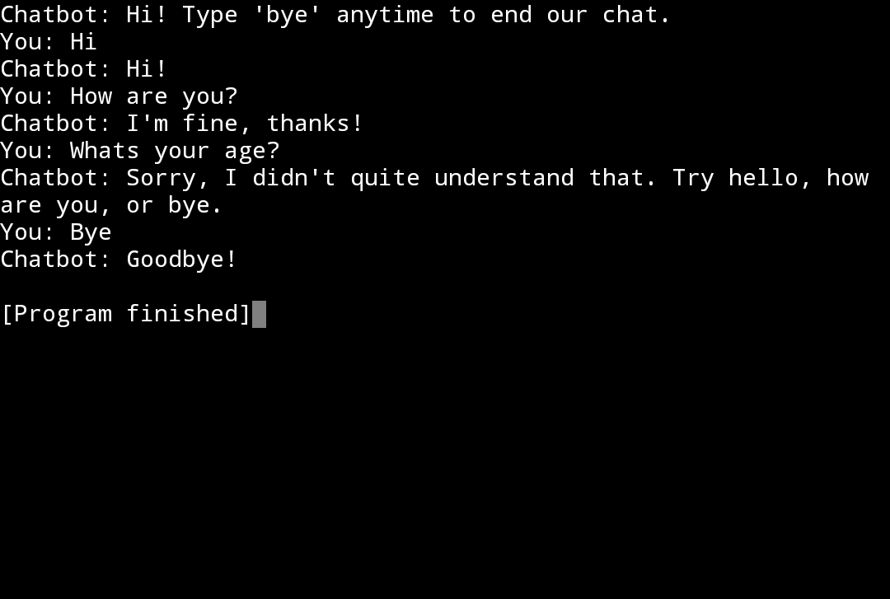

# 🤖 Basic Chatbot

A beginner-friendly rule-based chatbot built with Python.

## Features
- Responds to "hello"
- Responds to "how are you"
- Exits on "bye"
- Handles unknown inputs

## Screenshot



## Technologies Used
- Python

## Concepts Practiced
- if-elif statements
- while loops
- functions
- input/output

  ## Project Structure
```
Python-Chatbot/
├── chatbot.py          # Main chatbot program
├── README.md           # Project documentation
├── LICENSE             # MIT License
└── chatbot-demo.jpg    # Screenshot of the chatbot
```

## License
This project is licensed under the MIT License.
